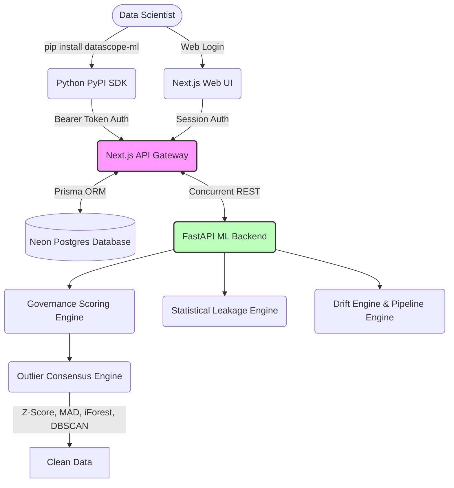

# DataScope: The Machine Learning Observability Platform

[](https://pypi.org/project/datascope-ml/)


A robust, enterprise-grade machine learning dataset evaluation and debugging platform. It automatically detects dataset issues, calculates precise ML impact scores through dynamic baseline modeling, and provides deterministic, three-state enterprise governance gating for production readiness.

Beyond a simple web dashboard, **DataScope is a complete Developer Platform**, offering a fully-fledged Python SDK (`datascope-ml`) that allows data scientists to trigger complex remote ML analytics directly from their Jupyter Notebooks or terminals.

<div align="center">

[The Python SDK](#the-python-sdk) • [Enterprise Governance](#enterprise-governance-lifecycle) • [Architecture](#architecture) • [Key Features](#key-features) • [Layer 1 Engines](#layer-1-engines)

</div>

---

## Enterprise Governance Lifecycle

DataScope natively supports a strict, deterministic **Three-State Arbitration Engine** acting as the single source of truth for deployment readiness. The system eliminates arbitrary threshold logic and assigns definitive states backed by mathematical consensus:

<div align="center">
  
  
  
</div>

1. **APPROVED (Ready)**: The dataset is structurally pristine, devoid of catastrophic data leakage, and exhibits high multi-model stability.
2. **AWAITING_REVIEW (Review Required)**: The engine detects moderate structural anomalies or moderate predictive redundancy requiring human semantic arbitration.
3. **REJECTED (Blocked)**: Critical deployment risks detected (e.g., severe leakage, high missingness, synthetic identifiers). Model deployment is strictly gated.

---

## The Python SDK (`datascope-ml`)

Why leave your IDE to clean your data? The official DataScope PyPI package bridges the gap between local data engineering workflows and our heavy-compute cloud infrastructure.

### Installation
```bash
pip install datascope-ml
```

### Usage
Generate your personal **SDK Key** securely from your DataScope web vault, and authenticate your local scripts:

```python
import datascope
import pandas as pd

# 1. Initialize the SDK with your API Key
client = datascope.Client(api_key="ds_your_generated_sdk_key_here")

# 2. Load your data
df = pd.read_csv("my_dataset.csv")

# 3. Analyze it!
client.analyze(df, project_name="Churn_Model_V2")
```

**What happens next?** 
The SDK securely streams your data to the cloud engines, processes the anomalies, and instantly pops open an interactive web dashboard in your browser with the full mathematical breakdown of your data health.

---

## Architecture

The system utilizes a structured, decoupled architecture orchestrating the frontend gateway and the analytical Python engines:



---

## Key Features

- **Python SDK Ecosystem** — Seamlessly trigger cloud analytics directly from local Jupyter Notebooks using the `datascope-ml` package.
- **Deterministic Deployment Gating** — Enforces a rigid `APPROVED` / `REVIEW` / `BLOCKED` lifecycle workflow.
- **Statistical Leakage Engine** — Completely replaces arbitrary feature importance heuristics with true probabilistic leakage detection via target correlation, mutual information, independent predictive power, and automated ID-blocking. 
- **Advanced Drift Detection** — Detects concept drift by concurrently calculating **Population Stability Index (PSI)**, **Kullback-Leibler (KL) Divergence**, **Wasserstein Distance**, and **Kolmogorov-Smirnov (KS) Statistics**.
- **Causal Impact & Feature Ablation** — Quantifies exact performance drops and variance explained by systematically ablating features and calculating permutation importance.
- **Consensus Outlier Detection** — Uses a multi-model weighted approach (Z-Score, MAD, Isolation Forest, DBSCAN) to robustly flag data anomalies.
- **Segmented Model Intelligence (SHAP)** — Computes Random Forest-based feature importances and SHAP-like segmented insights, specifically optimized for serverless deployments.

---

## Layer 1 Engines

### Statistical Leakage Engine (`layer1/services/governance_scoring.py`)
A dedicated subsystem generating probabilistic leakage classifications (`SAFE`, `SUSPICIOUS`, `HIGH_RISK`, `CONFIRMED_LEAKAGE`). It independently evaluates every feature via mutual information, standalone predictive modeling, and ablation impacts to mathematically confirm true causal leakage versus benign correlations.

### Governance Arbitrator (`layer1/services/governance_scoring.py`)
The ultimate source-of-truth orchestration layer. It applies conservative priors, penalizes missingness/synthetic identifiers, analyzes worst-case leakage scores, and calibrates a final deterministic Governance Status.

### Drift Engine (`layer1/services/drift_engine.py`)
Detects concept drift by comparing an uploaded test dataset against training data distributions. To guarantee accuracy, it goes beyond simple binning by concurrently running **4 different statistical methods**.

### Impact Engine (`layer1/services/impact_engine.py`)
Quantifies the severity of data issues by dynamically training baseline models (`scikit-learn`). 
- **Causal Impact**: Computes partial dependence (variance explained) and permutation importance.
- **Feature Ablation**: Measures exact performance drops (e.g., in R² or Accuracy) by removing features one at a time and retraining.

### Outlier Engine (`layer1/services/outlier_engine.py`)
Replaces naive statistical bounds with a highly robust **Consensus Algorithm**. It runs four independent anomaly detection methods concurrently and aggregates them into a normalized consensus score.

---

## License

MIT
