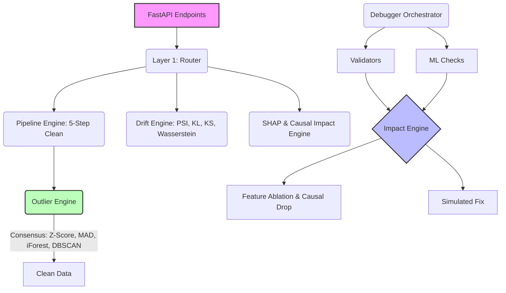

# DataScope 


A robust, intelligent machine learning dataset evaluation and debugging backend built in FastAPI. It automatically detects dataset issues, calculates precise ML impact scores through dynamic baseline modeling, and provides configurable, consensus-driven data-cleaning and drift-detection pipelines.

<div align="center">

[Features](#features) • [Live Access & Docs](#live-access--docs) • [Architecture](#architecture) • [Layer 1 Engines](#layer-1-engines) • [Benchmarks](#benchmarks--optimizations) • [API Reference](#api-reference)

</div>

---

## Key Features

- **Advanced Drift Detection** — Detects concept drift by concurrently calculating **Population Stability Index (PSI)**, **Kullback-Leibler (KL) Divergence**, **Wasserstein Distance**, and **Kolmogorov-Smirnov (KS) Statistics** to ensure absolute certainty.
- **Causal Impact & Feature Ablation** — Quantifies exact performance drops and variance explained by systematically ablating features, evaluating partial dependence (PDP), and calculating permutation importance.
- **Segmented Model Intelligence (SHAP)** — Computes Random Forest-based feature importances and SHAP-like segmented insights, specifically optimized for serverless deployments.
- **5-Step Dynamic Auto-Clean Pipeline** — A highly configurable pipeline builder that executes 5 critical steps: `impute_missing`, `remove_outliers`, `encode_categorical`, `drop_missing`, and `scale_features`.
- **Interactive Data Dictionary & EDA Dashboard** — Instantly generates rich column-level metadata, univariate outlier percentages, distribution bins, value counts, and correlation matrices for the frontend dashboard.
- **Consensus Outlier Detection** — Uses a multi-model weighted approach (Z-Score, MAD, Isolation Forest, DBSCAN) to robustly flag data anomalies.
- **Secure Vault Feature** — Securely persists historical data analyses with intelligent search deletion and complete database cascading.

## Live Access & Docs

Skip the local setup. DataScope is fully deployed and ready to use. 

- **Live Platform**: [Access DataScope](<https://datascope-app.vercel.app/>)
- **Interactive API Documentation**: Explore the backend schemas and test endpoints directly via the [FastAPI Swagger Docs](<https://akshat185-datascope.hf.space/docs>).


## Architecture

The system utilizes a structured Layer 1 service architecture to orchestrate dynamic pipelines and analytical engines:



## Layer 1 Engines

### Drift Engine (`layer1/services/drift_engine.py`)
Detects concept drift by comparing an uploaded test dataset against training data distributions. To guarantee accuracy, it goes beyond simple binning by concurrently running **4 different statistical methods**:
1. Population Stability Index (PSI)
2. Kullback-Leibler (KL) Divergence
3. Wasserstein Distance (Earth Mover's Distance)
4. Kolmogorov-Smirnov (KS) Statistic and P-Value

### Impact Engine (`layer1/services/impact_engine.py`)
Quantifies the severity of data issues by dynamically training baseline models (`scikit-learn`). 
- **Causal Impact**: Computes partial dependence (variance explained) and permutation importance.
- **Feature Ablation**: Measures exact performance drops (e.g., in R² or Accuracy) by removing features one at a time and retraining.

### Pipeline Engine (`layer1/services/pipeline_engine.py`)
A dynamic, JSON-configurable **5-Step Pipeline Builder** (`DataPipeline`) that guarantees reproducible data transformation steps and maintains execution logs. The 5 core steps are:
1. `impute_missing`: Mean, median, or mode strategies.
2. `remove_outliers`: Connects directly to the Consensus Outlier Engine.
3. `encode_categorical`: Label or One-Hot encoding.
4. `drop_missing`: Drops columns exceeding a configurable missing ratio threshold.
5. `scale_features`: Standard or Min-Max scaling.

### Outlier Engine (`layer1/services/outlier_engine.py`)
Replaces naive statistical bounds with a highly robust **Consensus Algorithm**. It runs four independent anomaly detection methods concurrently and aggregates them into a normalized consensus score:
1. **Statistical**: Z-Score and MAD Score (Median Absolute Deviation).
2. **Machine Learning**: Isolation Forest (Tree-based) and DBSCAN (Density-based clustering).

### SHAP / Model Intelligence Engine (`layer1/services/shap_engine.py`)
Provides segmented model intelligence. It quickly calculates native Random Forest feature importances mimicking SHAP behaviors, intentionally optimized for low-memory overhead to support HuggingFace Spaces deployments.

## Benchmarks & Optimizations

- **HuggingFace Spaces Optimization**: Native `scikit-learn` feature importances are utilized in the SHAP Engine instead of the heavy `shap` library, saving over **200MB+** of RAM and allowing the intelligence engine to run smoothly within strict HuggingFace memory constraints.
- **Vectorized Drift Computation**: PSI, Kullback-Leibler, and Wasserstein distance calculations are fully vectorized using NumPy and SciPy, ensuring near-instantaneous execution even on large production datasets.
- **Zero-Disk I/O Auto-Cleaning**: The 5-Step Pipeline Engine processes and returns cleaned datasets via an in-memory `io.StringIO` stream, eliminating disk write latencies.

## Project Structure

```text
├── main.py                          # FastAPI server, CORS, Data Dictionary & EDA logic
├── layer1/
│   ├── api/router.py                # Layer 1 endpoint routing
│   └── services/
│       ├── pipeline_engine.py       # 5-Step Dynamic auto-clean pipeline builder
│       ├── outlier_engine.py        # Consensus-based anomaly detection
│       ├── drift_engine.py          # 4-method data drift calculation (PSI, KL, Wasserstein, KS)
│       ├── shap_engine.py           # Segmented model intelligence
│       └── impact_engine.py         # Causal impact and feature ablation
├── debugger.py                      # Orchestrates validators and ML checks
├── ml_checks.py                     # Advanced machine learning-specific validations
├── validators.py                    # Core statistical and structural dataset checks
└── suggestions.py                   # Formats actionable suggestions for the frontend
```

## API Reference

- `POST /analyze` — Upload a dataset and receive a comprehensive array of issues sorted by ML Impact.
- `POST /data-dictionary` — Returns column-level metadata, including univariate outlier percentages powered by the Layer 1 Consensus engine.
- `POST /eda` — Generates distribution bins, categorical value counts, correlation matrices, and boxplot outlier stats for the EDA Dashboard.
- `POST /shap` — Returns Random Forest-based feature importances and segmented model intelligence.
- `POST /clean` — Executes the robust 5-step data sanitation pipeline.
- `POST /drift` — Compares a test dataset against training distributions to detect PSI, KL, KS, and Wasserstein drift.

## License

MIT
