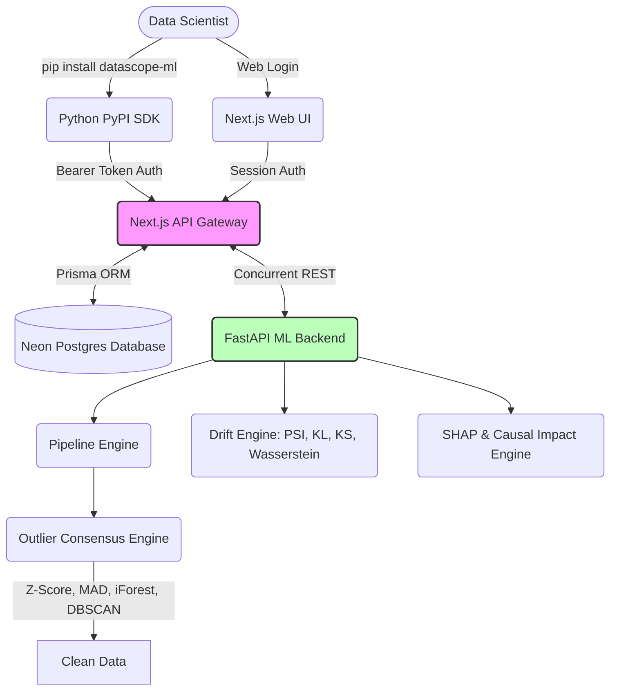

# DataScope: The Machine Learning Observability Platform

[](https://pypi.org/project/datascope-ml/)


A robust, enterprise-grade machine learning dataset evaluation and debugging platform. It automatically detects dataset issues, calculates precise ML impact scores through dynamic baseline modeling, and provides configurable, consensus-driven data-cleaning and drift-detection pipelines.

Beyond a simple web dashboard, **DataScope is a complete Developer Platform**, offering a fully-fledged Python SDK (`datascope-ml`) that allows data scientists to trigger complex remote ML analytics directly from their Jupyter Notebooks or terminals.

<div align="center">

[The Python SDK](#the-python-sdk) • [Security & Privacy](#security--privacy) • [Architecture](#architecture) • [Key Features](#key-features) • [Layer 1 Engines](#layer-1-engines) • [API Reference](#api-reference)

</div>

---

## The Python SDK (`datascope-ml`)

Why leave your IDE to clean your data? The official DataScope PyPI package bridges the gap between local data engineering workflows and our heavy-compute cloud infrastructure.

### Installation
```bash
pip install datascope-ml
```

### Usage
Generate your personal **SDK Key** securely from your DataScope web vault, and authenticate your local scripts:

```python
import datascope
import pandas as pd

# 1. Initialize the SDK with your API Key
client = datascope.Client(api_key="ds_your_generated_sdk_key_here")

# 2. Load your data
df = pd.read_csv("my_dataset.csv")

# 3. Analyze it!
client.analyze(df, project_name="Churn_Model_V2")
```

**What happens next?** 
The SDK securely streams your data to the cloud engines, processes the anomalies, and instantly pops open an interactive web dashboard in your browser with the full mathematical breakdown of your data health.

---

## Security & Privacy

DataScope is designed with privacy-first principles:
- **Zero-Disk Storage Policy**: When using the SDK, your local dataset is never saved as a temporary file on your hard drive. It is converted to an in-memory `io.StringIO` buffer and streamed directly to the cloud.
- **Cryptographic API Management**: SDK authentication is handled via a secure, singleton API Key system linked directly to your account using industry-standard `Bearer` tokens. Your generated key is uniquely tied to your PostgreSQL user ID.
- **Data Ephemerality**: By default, datasets are processed in memory on our HuggingFace backend and immediately discarded after the analytical results are generated and stored.

---

## Architecture

The system utilizes a structured, decoupled architecture orchestrating the frontend gateway and the analytical Python engines:



---

## Key Features

- **Python SDK Ecosystem** — Seamlessly trigger cloud analytics directly from local Jupyter Notebooks using the `datascope-ml` package.
- **Semantic PII Detection** — Intelligently scans columns using Regex and natural language heuristics to flag sensitive Personal Identifiable Information (SSNs, emails) and extreme class imbalances.
- **Export to Python** — Instantly generates copy-pasteable `pandas` and `scikit-learn` code snippets directly from the UI, applying the exact mathematical fixes recommended by the engines.
- **Advanced Drift Detection** — Detects concept drift by concurrently calculating **Population Stability Index (PSI)**, **Kullback-Leibler (KL) Divergence**, **Wasserstein Distance**, and **Kolmogorov-Smirnov (KS) Statistics** to ensure absolute certainty.
- **Causal Impact & Feature Ablation** — Quantifies exact performance drops and variance explained by systematically ablating features, evaluating partial dependence (PDP), and calculating permutation importance.
- **Consensus Outlier Detection** — Uses a multi-model weighted approach (Z-Score, MAD, Isolation Forest, DBSCAN) to robustly flag data anomalies, eliminating false positives.
- **Segmented Model Intelligence (SHAP)** — Computes Random Forest-based feature importances and SHAP-like segmented insights, specifically optimized for serverless deployments.
- **5-Step Dynamic Auto-Clean Pipeline** — A highly configurable pipeline builder that executes 5 critical steps: `impute_missing`, `remove_outliers`, `encode_categorical`, `drop_missing`, and `scale_features`.

---

## Layer 1 Engines

### Drift Engine (`layer1/services/drift_engine.py`)
Detects concept drift by comparing an uploaded test dataset against training data distributions. To guarantee accuracy, it goes beyond simple binning by concurrently running **4 different statistical methods**.

### Impact Engine (`layer1/services/impact_engine.py`)
Quantifies the severity of data issues by dynamically training baseline models (`scikit-learn`). 
- **Causal Impact**: Computes partial dependence (variance explained) and permutation importance.
- **Feature Ablation**: Measures exact performance drops (e.g., in R² or Accuracy) by removing features one at a time and retraining.

### Pipeline Engine (`layer1/services/pipeline_engine.py`)
A dynamic, JSON-configurable **5-Step Pipeline Builder** (`DataPipeline`) that guarantees reproducible data transformation steps and maintains execution logs.

### Outlier Engine (`layer1/services/outlier_engine.py`)
Replaces naive statistical bounds with a highly robust **Consensus Algorithm**. It runs four independent anomaly detection methods concurrently and aggregates them into a normalized consensus score.

---

## API Reference

- `POST /analyze` — Upload a dataset and receive a comprehensive array of issues sorted by ML Impact.
- `POST /data-dictionary` — Returns column-level metadata, including univariate outlier percentages powered by the Layer 1 Consensus engine.
- `POST /eda` — Generates distribution bins, categorical value counts, correlation matrices, and boxplot outlier stats for the EDA Dashboard.
- `POST /shap` — Returns Random Forest-based feature importances and segmented model intelligence.
- `POST /clean` — Executes the robust 5-step data sanitation pipeline.
- `POST /drift` — Compares a test dataset against training distributions to detect PSI, KL, KS, and Wasserstein drift.

## License

MIT
